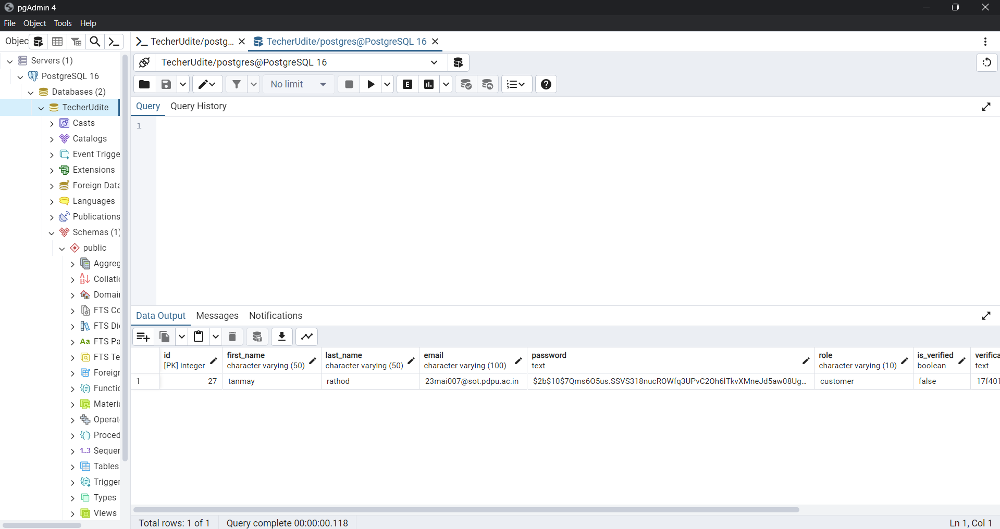
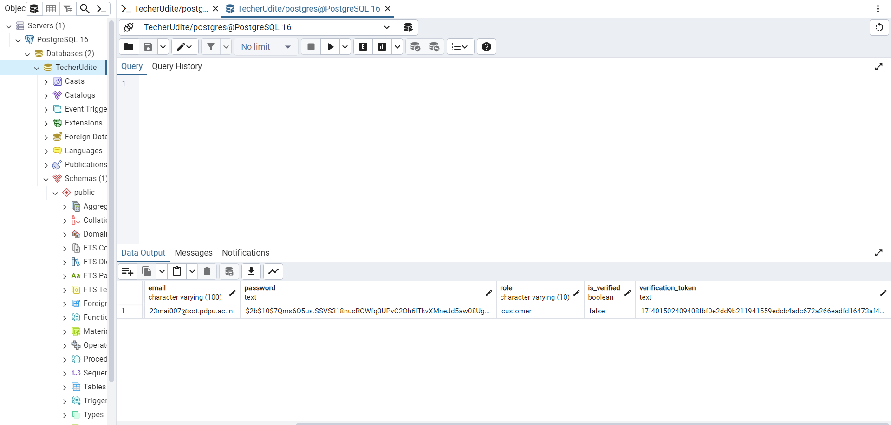
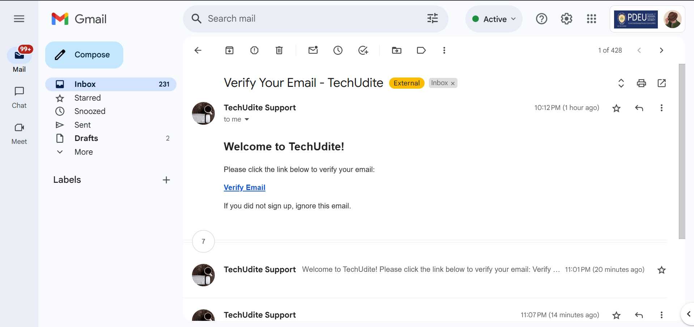

# Backend API

## Introduction
This is the backend for the application, built with Express.js. It provides authentication and user management features.

## Installation

### Prerequisites
- Node.js (latest LTS version recommended)
- npm or yarn

### Setup
1. Clone the repository:
   ```sh
   git clone <repository_url>
   cd <project_directory>
   ```
2. Install dependencies:
   ```sh
   npm install
   ```
3. Start the development server:
   ```sh
   npm run dev
   ```

## API Endpoints

### Authentication

#### Register User
**Endpoint:**
```
POST http://localhost:5000/api/auth/register
```

**Request Body:**
```json
{
  "first_name": "John",
  "last_name": "Doe",
  "email": "dean@example.com",
  "password": "password123",
  "role": "customer"
}
```

**Response:**
```json
{
  "message": "User registered successfully",
  "user": {
    "id": "12345",
    "first_name": "John",
    "last_name": "Doe",
    "email": "dean@example.com",
    "role": "customer"
  }
}
```

## Running the Server
To run the backend server in development mode, use:
```sh
npm run dev
```
For production mode:
```sh
npm start
```
 

 


 